# ShopFlow-E-commerce-Projekt-oczyszczania-danych

## 🎯 Cel projektu

Celem projektu było dokładne oczyszczenie danych sprzedażowych sklepu internetowego **ShopFlow**.  

## Opis projektu
Dane pochodzą z symulowanego sklepu internetowego **ShopFlow**, działającego na rynku polskim w branży e-commerce, obejmującej m.in.:

- modę,
- elektronikę,
- dom i wnętrza,
- urodę.

Zbiór obejmuje około **85 000 rekordów** w 5 powiązanych tabelach i obejmują **24 miesiące historii sprzedaży**:

- klienci – ok. 5 000 rekordów,
- produkty – ok. 2 000 rekordów,
- zamówienia – ok. 20 000 rekordów,
- pozycje zamówień – ok. 49 000 rekordów,
- stany magazynowe – 2 000 rekordów.

## 🧹 Czyszczenie i przygotowanie danych

Przed rozpoczęciem właściwej analizy przeprowadzono kontrolę jakości danych we wszystkich tabelach.

Zidentyfikowano m.in.:
- braki danych,
- duplikaty,
- niespójne formaty,
- błędne wartości,
- literówki,
- wartości odstające,
- problemy z integralnością danych.

Problemy te zostały przeanalizowane i naprawione przy użyciu SQL oraz PostgreSQL.

---

### 👤 Tabela `customers`
Tabelę `customers` zaczęto sprawdzać pod kątem występowania duplikatów customer_id. Sprawdzono też poprawność imion i nazwisk. Sprawdzono też, czy imiona i nazwiska nie zawierają pustych wartości, spacji, a także czy imiona i nazwiska zawierają znaki i cyfry. Nie znaleziono błędów w kolumnach customer_id, first_name i last_name

-- 

Analizując pozostałe kolumny zidentyfikowano następujące problemy: 

#### 1. Niespójne formaty numerów telefonów

Numery telefonów występowały w wielu różnych formatach, np. z prefiksem `+48`, bez prefiksu, ze spacjami lub myślnikami. 

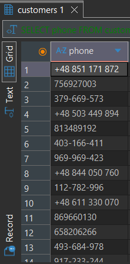

Numery telefonów zostały ustandaryzowane do jednego formatu `+48XXXXXXXXX’:
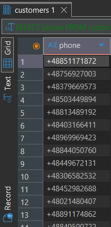

Występowały także brakujące numery telefonów, które ustawiono jako ‘unknown’ 
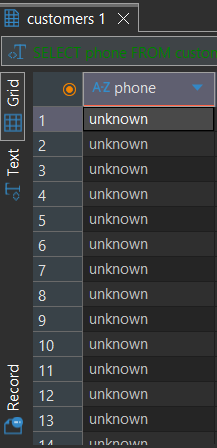
Kolumnę z numerem telefonu przeanalizowano także pod kątem długości numeru telefonu 

---

#### 2. Niepoprawne kody pocztowe

W kolumnie ‘postalcode’ część kodów pocztowych klientów nie była zgodna z polskim formatem `XX-XXX`.

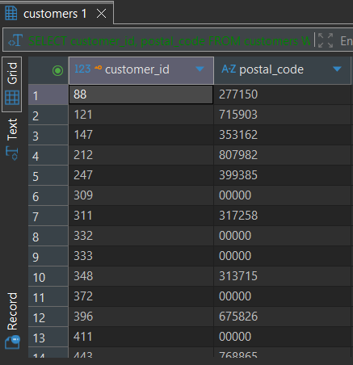

Rekordy, których nie można było poprawić, zostały oznaczone do dalszej weryfikacji:
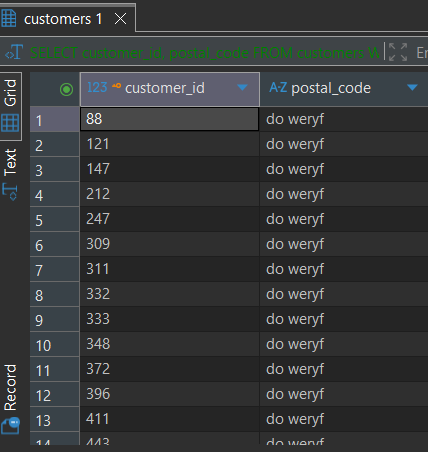

---

#### 3. Niespójne adresy e-mail
W adresach e-mail pojawiły się:
- różnice w wielkości liter,
- zbędne spacje,
- brak jednolitego formatu.

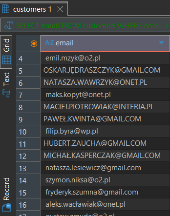

Adresy zostały ujednolicone do jednego formatu: 
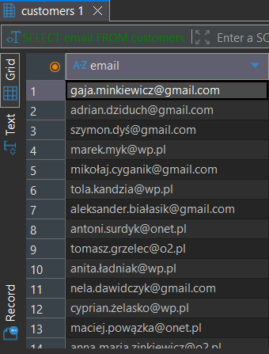

---

#### 4. Literówki i niespójne nazwy miast
W kolumnie `city` występowały różne warianty tej samej miejscowości, np. Warsszawa, Warszawa oraz problemy z wielkością liter.

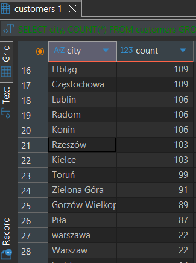

W tym celu utworzono utworzono tabelę mapującą, która pozwoliła przypisać błędne warianty do poprawnych nazw miast.  Poniżej przedstawiono poprawioną kolumnę ‘city:
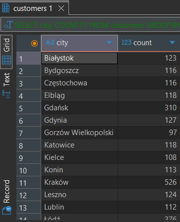

---

#### 5. Duplikaty klientów

Wykryto również rekordy klientów posiadających ten sam znormalizowany adres e-mail.

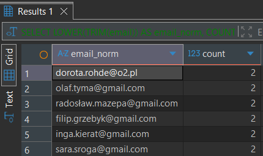

Duplikaty klientów zostały scalone na podstawie znormalizowanego adresu e-mail. Zachowano rekord z najwcześniejszą datą rejestracji, przepisano do niego historię zamówień, a pozostałe duplikaty usunięto.
---

#### 6. Dodatkowe duplikaty z sufiksem `_dup`

Część duplikatów posiadała zmodyfikowany adres e-mail, np.:
`jan.kowalski@gmail.com`  
`jan.kowalski_dup@gmail.com`

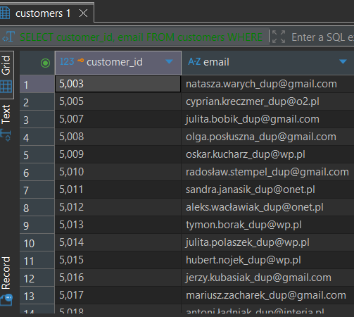

Takie rekordy wymagały osobnej reguły identyfikacji i scalania. Adresy email oczyszczono z błędów: 

#### 7. Klienci bez zamówienia
Zidentyfikowano klientów, którzy założyli konto, ale nie złożyli żadnego zamówienia.
Rekordy te nie zostały usunięte, ponieważ nie stanowią błędu danych. Utworzono widok `klienci_bez_zamowien`, aby umożliwić dalszą analizę tego segmentu pod kątem aktywacji, retencji i konwersji klientów.

---
### 📦 Tabela `products`

W tabeli produktów problemy dotyczyły przede wszystkim cen oraz niespójnych kategorii produktowych.

#### 1. Produkty z ceną równą 0

W katalogu znaleziono produkty, których `unit_price` wynosiło `0`.

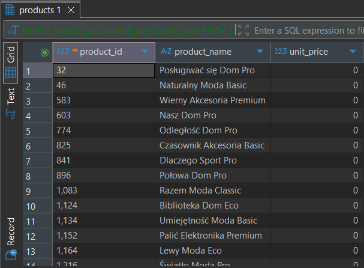

Rekordy nie zostały automatycznie usunięte. Zostały oznaczone do weryfikacji, ponieważ bez dodatkowych informacji nie można było jednoznacznie stwierdzić, czy cena była błędem.
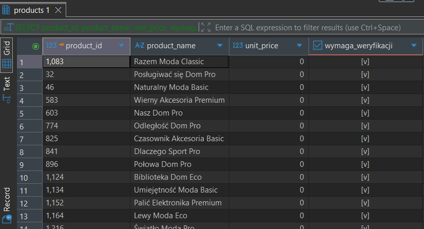

#### 2. Niespójne kategorie produktów

Nazwy kategorii występowały w różnych wariantach, m.in.:
- różna wielkość liter,
- polskie i angielskie nazwy,
- dodatkowe spacje,
- różne warianty tej samej kategorii.

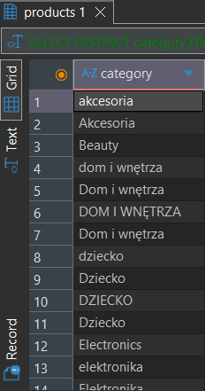

Kategorie zostały poprawione do jednolitego zestawu wartości.
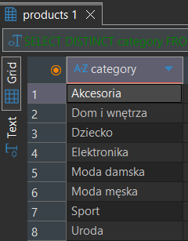

---

#### 3. Wartości odstające cen produktów

W danych występowały produkty o cenach znacznie wyższych niż typowe ceny z danej kategorii.

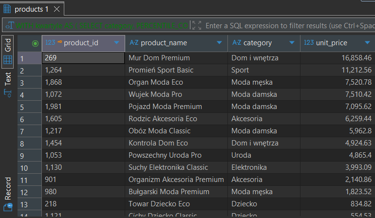

Potencjalne wartości odstające zostały wykryte metodą statystyczną IQR. Rekordy te nie zostały usunięte, ponieważ wysoka cena produktów nie musi oznaczać błędu danych. W rzeczywistym projekcie rekordy te wymagałaby dodatkowej weryfikacji biznesowej: 

---

### 🧾 Tabela `orders`

W tabeli zamówień zidentyfikowano problemy związane z duplikacją rekordów oraz formatem dat.

#### 1. Duplikaty zamówień

Wykryto klientów posiadających więcej niż jedno zamówienie o tej samej dacie.

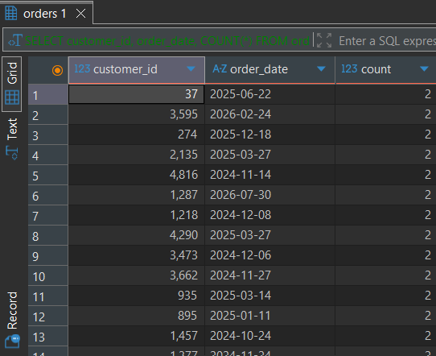

Duplikaty zamówień zostały zidentyfikowane na podstawie `customer_id` i `order_date`. W każdej grupie zachowano rekord z najniższym `order_id`. Najpierw usunięto powiązane pozycje z tabeli `order_items`, a następnie nadmiarowe rekordy z tabeli `orders`.
---

#### 2. Niespójne formaty dat

Daty zamówień występowały w kilku formatach, np.:
- `08.09.2024`
- `26/12/2024`
- `2024-12-26`

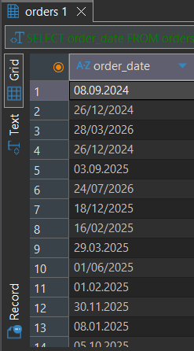

Wszystkie daty zostały ujednolicone do formatu `YYYY-MM-DD`. Następnie przekonwertowano kolumnę na typ `DATE`.
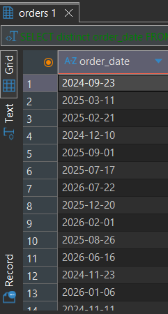

#### 3. Braki w metodzie płatności 
W kolumnie `payment_method` występowały puste wartości zapisane jako pusty tekst 
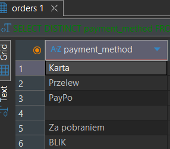

Puste rekordy zostały przekonwertowane do `NULL`, a następnie zweryfikowano ich zgodność ze statusem zamówienia. Braki występowały przy zamówieniach anulowanych (`Cancelled`), dlatego uznano je za poprawne i pozostawiono bez dalszych zmian.

---

### 🛒 Tabela `order_items`

#### 1. Ujemne wartości `quantity`
W tabeli pozycji zamówień występowały rekordy z ujemną liczbą produktów.
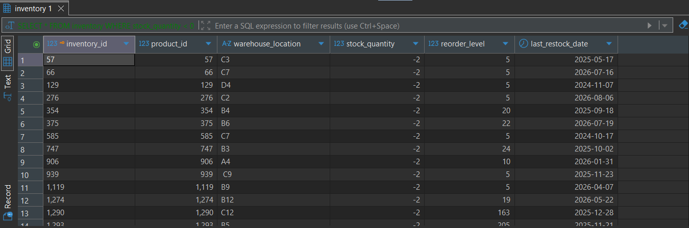
Ujemne wartości zostały zinterpretowane jako zwroty zapisane w niewłaściwym miejscu. Nie zmieniono wartości ujemnych. W tym celu utworzono osobą tabelę `returns`, do której przeniesiono informacje o zwrotach: 
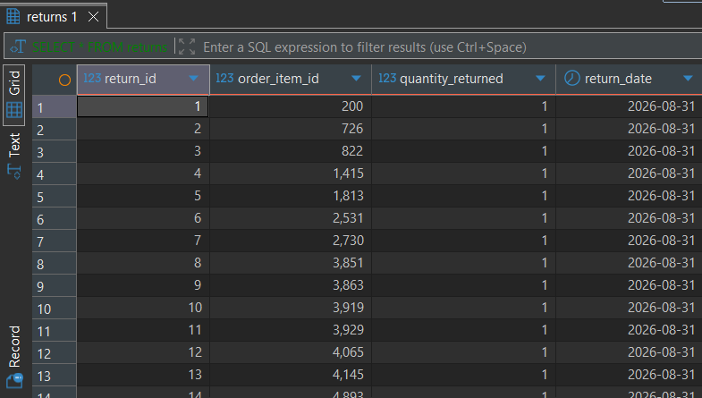

#### 2. Niespójne kategorie produktów
W tabeli `order_items` występowały osierocone `product_id`, czyli rekordy odwołujące się do produktów nieistniejących już w tabeli `products`.

Utworzono techniczny rekord `Produkt zarchiwizowany / brak danych` z `product_id = -1`, a następnie przypisano do niego wszystkie osierocone pozycje zamówień. Dzięki temu zachowano historyczne dane sprzedażowe i przywrócono spójność między tabelami.

---
### 🏭 Tabela `inventory`
W danych magazynowych zidentyfikowano problemy związane ze stanami magazynowymi oraz formatem lokalizacji.

#### 1. Ujemne stany magazynowe

W kolumnie `stock_quantity` występowały wartości poniżej zera.

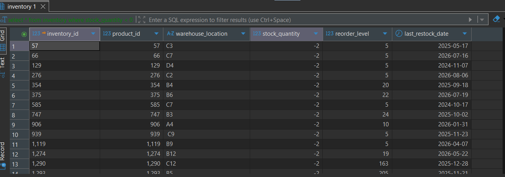

Ujemne wartości zostały zastąpione wartością `0`, ponieważ fizyczny stan magazynowy nie może być ujemny. Również te rekordy wymagają zweryfikowania dlaczego pojawiły się ujemne wartości w stanie magazynowym. 

---

#### 2. Zbędne spacje w lokalizacji magazynowej

W kolumnie `warehouse_location` występowały dodatkowe spacje.

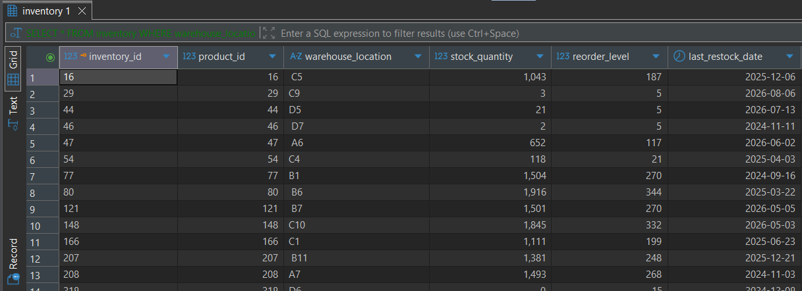

Spacje zostały usunięte: 
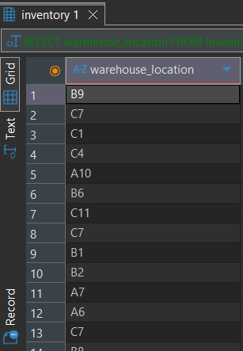

